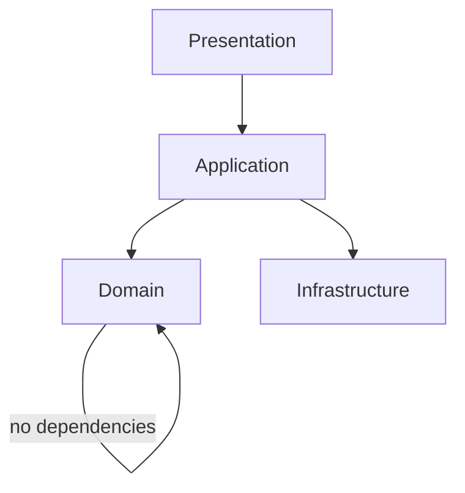
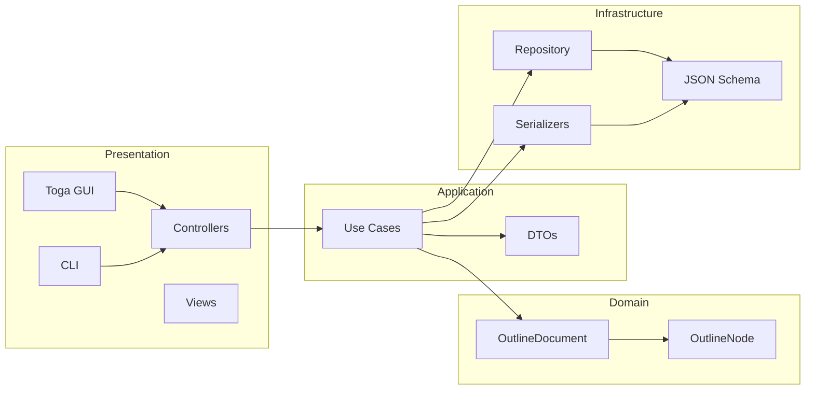
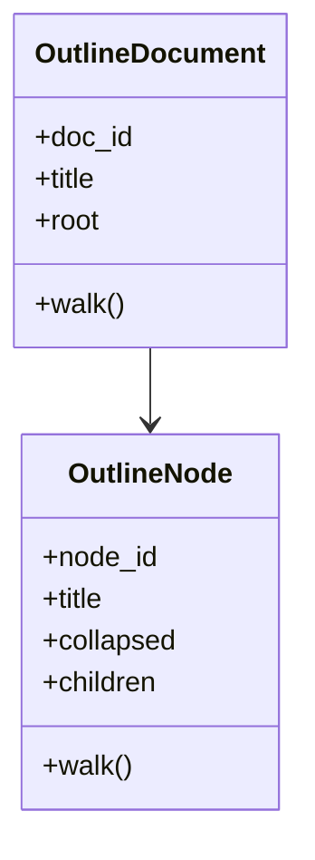
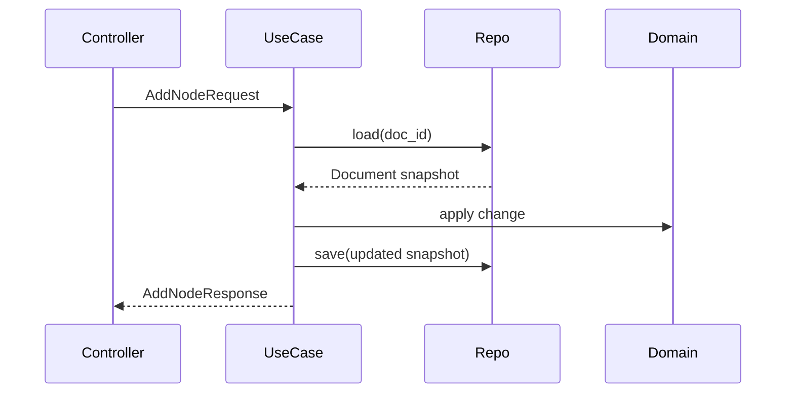
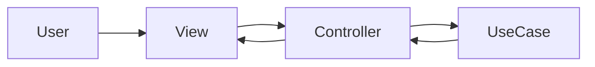
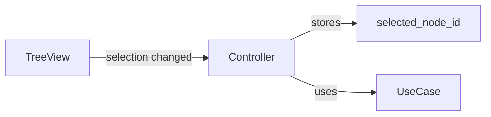
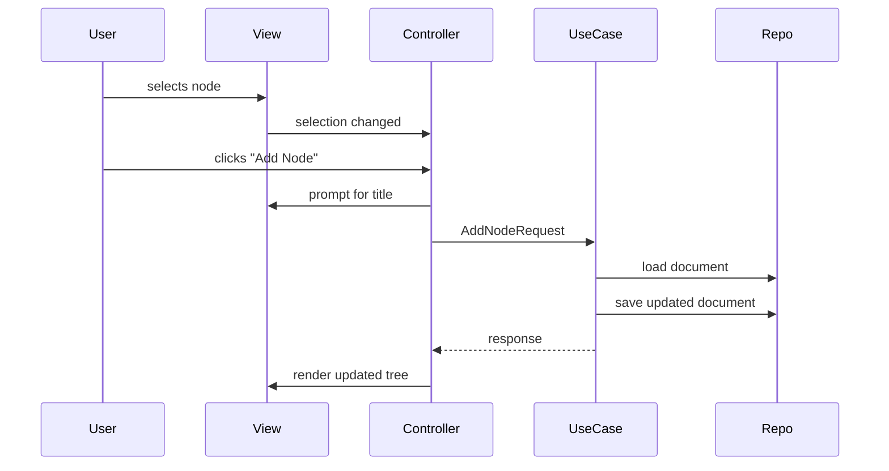
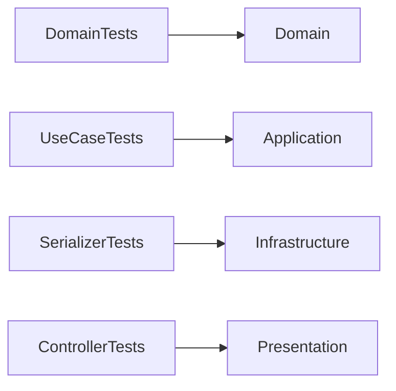

# Architecture

This document explains how the Outline Tool is structured, how the parts fit together, and how behavior flows through the system.

The goal is not academic purity.  
The goal is **change without breakage**.

If something here feels boring, that’s intentional. Boring systems survive.


## High-level structure

The Outline Tool uses a **layered architecture** with strict dependency direction.

Mermaid version, because ASCII art lies:



### Dependency rule

- Dependencies point **inward**
- Outer layers may depend on inner layers
- Inner layers never depend on outer layers

No shortcuts. No “just this once.”


## Layer overview



This is the *actual* system you built, not a theoretical one.


## Core principles

### 1. Domain is pure

The domain layer contains **only structure and invariants**.



The domain:

- Knows nothing about files
- Knows nothing about Toga
- Knows nothing about JSON, YAML, or OPML
- Does not validate schemas
- Does not perform I/O

If the UI vanished tomorrow, the domain would still function.

If the domain breaks, everything breaks. That’s why it stays small.


### 2. Application layer expresses intent

The application layer answers questions like:

- What does “add node” *mean*?
- What happens when something is renamed?
- What rules apply when deleting?

It is composed of:

- **Use cases** (commands)
- **DTOs** (requests and responses)



Use cases:

- Accept validated input
- Load domain snapshots
- Apply domain behavior
- Persist via repositories
- Return **immutable snapshots**

No UI logic.  
No widgets.  
No dialogs.  

If a use case ever asks “what button was clicked,” it’s wrong.


### 3. Infrastructure is replaceable by design

Infrastructure answers one question:

> “How does this touch the outside world?”

```mermaid
flowchart LR
    UseCase --> Repo
    UseCase --> Serializer

    Repo --> InMemory[InMemory Repo]
    Repo --> FileSystem[Filesystem Repo (future)]

    Serializer --> JSON
    Serializer --> YAML
    Serializer --> Markdown
    Serializer --> OPML

    JSON --> Schema
    YAML --> Schema
    Markdown --> Schema
    OPML --> Schema
```

Infrastructure:

- Implements ports defined by the application layer
- Performs I/O
- Validates against schema
- Is allowed to fail loudly

Infrastructure is **not clever**.  
It is intentionally boring and disposable.


### 4. Presentation coordinates, it does not decide

The presentation layer exists to translate human intent into application actions.



Controllers:

- Track selection
- Prompt for user input
- Call use cases
- Render snapshots
- Display errors

Controllers **do not**:

- Mutate trees directly
- Perform persistence
- Serialize data
- Invent rules

If a controller feels “smart,” that’s a smell.


## MVC mapping (concrete, not theoretical)

| MVC Part | Implementation |
|--------|----------------|
| Model | Domain + Application |
| View | `views.py` |
| Controller | `controllers.py` |

This is classic MVC because:

- Toga is imperative
- Explicit controllers are testable
- Call stacks are visible
- Debugging does not require philosophy

No observers.  
No reactive chains.  
No “magic.”


## Selection as first-class state

Selection is **not domain state**.



Why this matters:

- The domain does not care what is selected
- Selection is user intent, not data
- Controllers need selection to route commands

This keeps UI concerns out of domain models and avoids contamination.


## Behavioral walkthrough: Add Node

Concrete example of data flow:



Nothing is implicit.  
Nothing happens “behind the scenes.”


## Testing strategy (architectural intent)



- Domain tests: pure, fast, no mocks
- Application tests: fake repos, real rules
- Infrastructure tests: round-trip correctness
- Controller tests: fake views, fake dialogs
- View tests: structural, minimal, no OS dependence

If a test needs a real window, it’s probably the wrong test.


## What this architecture optimizes for

- Local reasoning
- Replaceable storage
- Predictable behavior
- Explicit control flow
- Long-term maintainability

What it does *not* optimize for:

- Clever abstractions
- Minimal file count
- Framework fashion
- “Feels elegant” blog posts


## If you change this architecture

Good reasons:

- Multiple frontends
- Collaborative editing
- Persistent background sync
- Offline/online reconciliation

Bad reasons:

- Trends
- Tutorials
- “This feels heavy”

If it still feels simple after six months, it’s working.


If you want, the next **useful** diagrams would be:

- `add-node.mmd`
- `rename-delete.mmd`
- `import-export.mmd`
- `gui-mvc-detail.mmd`

Those explain behavior even better than words.