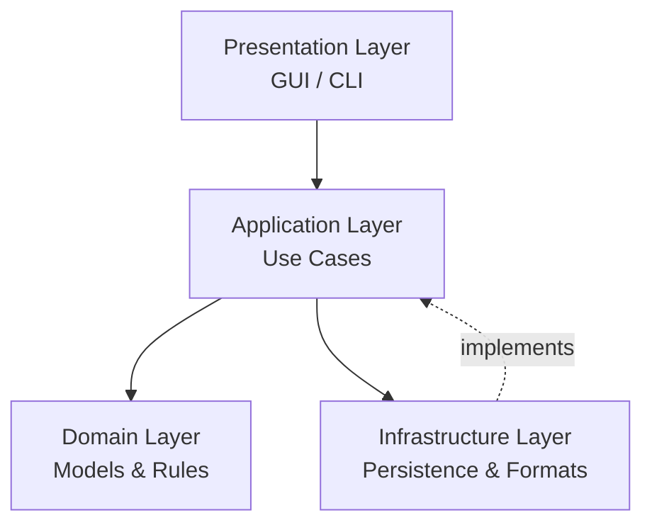
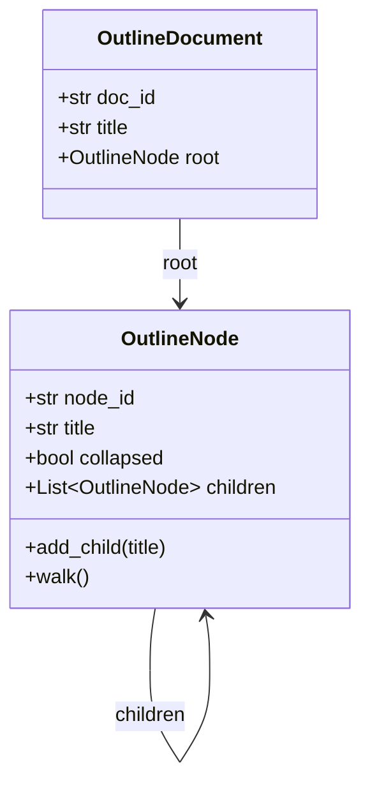
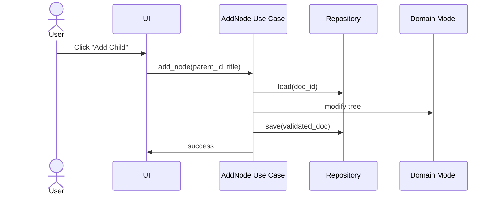
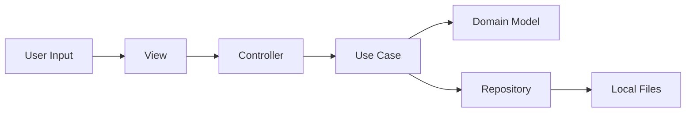

# Software Design and Architecture  
**Outline Tool**

## Purpose

Outline Tool is an offline-first, minimalist outlining application designed to support structured thinking with minimal cognitive overhead. The system prioritizes:

- Clear separation of concerns
- Enforceable contracts between layers
- Deterministic behavior suitable for long-lived documents
- Interoperability via well-defined formats
- Native-feeling cross-platform UI

This document describes the **current architecture**, **design patterns**, **class model**, **information flow**, and **core use cases**.

---

## Architectural Overview

The application follows a **layered MVC architecture** with explicit boundaries enforced by contracts.

### Architectural Layers

1. **Domain Layer**  
   Pure business logic and data structures. No I/O. No UI. No framework dependencies.

2. **Application Layer**  
   Use cases and orchestration logic. Defines ports (interfaces) for infrastructure.

3. **Infrastructure Layer**  
   Implements persistence and serialization. Swappable without impacting core logic.

4. **Presentation Layer**  
   User interaction via GUI (Toga) and optional CLI. Depends only on application layer.

### High-Level Architecture



**Key rule:**  
Dependencies only point *inward*. The domain layer has zero knowledge of the outside world.

---

## Design Principles

- **Offline-first**: No network dependencies.
- **Local ownership**: All data remains on disk under user control.
- **Contracts over conventions**: JSON Schema validates all persisted data.
- **Composable formats**: Import/export via adapters, not conditionals.
- **Minimal surface area**: Fewer objects, clearer responsibilities.

---

## Core Design Patterns

### Model–View–Controller (MVC)

Used in the **presentation layer** only.

| Component | Responsibility |
|---------|----------------|
| Model | Domain objects (`OutlineDocument`, `OutlineNode`) |
| View | GUI widgets (tree view, buttons, text fields) |
| Controller | Translates user events into application use cases |

Controllers never manipulate domain objects directly. They call use cases.

---

### Command Pattern (Use Cases)

Each application action is represented as a **command-like use case**.

Examples:
- `CreateDocument`
- `AddNode`
- `RenameNode`
- `DeleteNode`
- `MoveNode`
- `ToggleCollapse`
- `ExportDocument`
- `ImportDocument`

This enables:
- Testable behavior
- Explicit intent
- UI and CLI reuse
- Event logging at the command boundary

---

### Repository Pattern

The application layer defines a **repository port**:

```python
class DocumentRepository(Protocol):
    def load(self, doc_id: str) -> StoredDocument: ...
    def save(self, doc: StoredDocument) -> None: ...
```

Implementations:
- In-memory (tests, early iterations)
- Filesystem (production)

The domain does not know where documents come from or go to.

---

### Adapter / Strategy Pattern (Serialization)

Each format is implemented as a **serializer adapter**:

| Format | Adapter |
|------|--------|
| OPML | `OpmlSerializer` |
| Markdown | `MarkdownSerializer` |
| Plain text | `PlainTextSerializer` |
| YAML | `YamlSerializer` |
| JSON | `JsonSerializer` |
| Custom JSON | `FinalStateSerializer` |

All serializers conform to the same interface:

```python
class Serializer(Protocol):
    format_name: str
    def dumps(self, payload: dict) -> str
    def loads(self, text: str) -> dict
```

Selection is handled via a registry, not branching logic.

---

### Contract Pattern (Schema Validation)

A JSON Schema defines the **canonical outline document format**.

Validation occurs at:
- Import boundaries
- Repository save
- Repository load

This prevents silent corruption and enforces long-term stability.

---

## Domain Model

### Class Diagram



### Domain Rules

- Nodes form a strict tree (no cycles).
- Node identity is stable via UUID.
- Order of children is meaningful.
- Collapsed state is purely presentational but persisted.

---

## Application Layer

### Responsibilities

- Orchestrate domain operations
- Enforce contracts
- Coordinate persistence
- Emit structured logs

### Use Case Flow Example: Add Node



---

## Infrastructure Layer

### Persistence Strategy

- Documents stored as structured JSON
- Atomic writes (write → fsync → rename)
- One document per file
- No background mutation

### Format Interoperability

- All exports originate from the canonical JSON structure
- All imports must validate against schema
- Round-trip tests are mandatory

---

## Presentation Layer

### GUI (Toga)

Responsibilities:
- Render outline tree
- Capture user intent
- Forward actions to controllers

Non-responsibilities:
- Tree mutation logic
- Persistence logic
- Validation logic

### Controller Responsibilities

- Translate UI events into use case calls
- Maintain minimal UI state
- Handle error presentation

Controllers do not:
- Traverse the tree directly
- Edit node structures manually

---

## Information Flow Summary



---

## Core Use Cases

### Document Lifecycle

- Create document
- Open document
- Save document
- Export document
- Import document

### Structural Editing

- Add node (child/sibling)
- Rename node
- Delete node
- Move node (up/down)
- Indent / outdent node
- Toggle collapse

### Format Operations

- Export to OPML
- Export to Markdown
- Export to plain text
- Export to YAML / JSON
- Import from same formats

---

## Logging Strategy

- Use case entry/exit logged at INFO
- Infrastructure operations logged at DEBUG
- Validation failures logged at ERROR
- No logging inside domain objects

This keeps logs meaningful and readable.

---

## Testing Strategy

| Layer | Test Type |
|-----|----------|
| Domain | Unit tests (pure logic) |
| Contracts | Schema validation tests |
| Application | Use case tests with fake repos |
| Infrastructure | Round-trip serialization tests |
| Presentation | Thin controller tests only |

UI behavior is validated indirectly through controller tests.

---

## Evolution Strategy

The architecture is designed to support:
- Additional formats without refactoring
- Multiple UIs (GUI, CLI, future web shell)
- Long-lived documents with backward compatibility
- Structured publishing pipelines (Final State Press)

---

## Non-Goals

- Real-time collaboration
- Cloud sync
- Formatting-rich editors
- Opinionated writing workflows

This tool is for **thinking**, not decorating text.